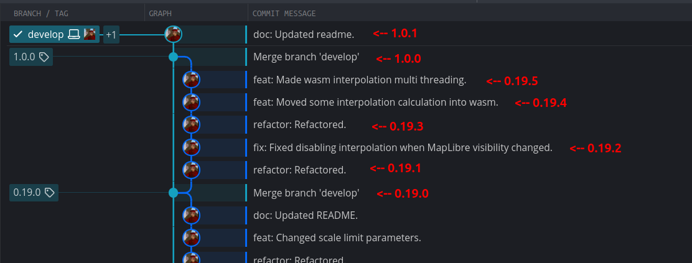

# screw-up-native

Native CLI that Git versioning metadata dumper/formatter.


[](https://www.repostatus.org/#wip)
[](https://opensource.org/licenses/MIT)

----

## What is this?

Wouldn't you like to automatically insert calculated version information from Git tags into your source code or text files?
This CLI tool is the perfect little knife for the job.

```bash
# Dump Git repository metadata resolved (JSON)
screw-up dump

# Format a template with Git metadata placeholders
echo "This version is '{version}'" | screw-up format
```

Version numbers are automatically calculated from Git tags and adhere to the [screw-up](https://github.com/kekyo/screw-up/) convention.
This calculates the version number by measuring the commit height to the current HEAD based on the last applied version tag.



You can use metadata such as version numbers, Git commit hashes, timestamps, and commit messages to format text or output it as JSON:

```json
{
  "git": {
    "tags": [],
    "branches": ["develop"],
    "version": "1.13.2",
    "commit": {
      "hash": "49a4245d6c5ce6604167005f5234c1c4a38a852b",
      "shortHash": "49a4245",
      "date": "2025-12-05T11:50:38+09:00",
      "message": "feat: Added force dump mode."
    }
  },
  "version": "1.13.2",
  "buildDate": "2025-12-28T17:30:30+09:00"
}
```

The CLI command is available via Linux packages (Ubuntu/Debian) and prebuilt Windows binaries, making it easy to use.

----

## Installation

[Here is pre-built packages/binaries.](https://github.com/kekyo/screw-up-native/releases)

For Ubuntu/Debian:

```bash
sudo apt install ./screw-up-ubuntu-noble-amd64-1.2.3.deb
```

For Windows (64/32bit):

Extract zip file (contains single `screw-up.exe` file).

## Dump Command

Dump computed metadata as JSON:

```bash
# Dump current Git repository
screw-up dump
```

As shown in the following output example, Git commit information is also added:

```json
{
  "git": {
    "tags": [],
    "branches": ["develop"],
    "version": "1.13.2",
    "commit": {
      "hash": "49a4245d6c5ce6604167005f5234c1c4a38a852b",
      "shortHash": "49a4245",
      "date": "2025-12-05T11:50:38+09:00",
      "message": "feat: Added force dump mode."
    }
  },
  "version": "1.13.2",
  "buildDate": "2025-12-28T17:30:30+09:00"
}
```

The dump command:

- Shows the final computed metadata after all processing (workspace inheritance, Git metadata, etc.)
- Useful for debugging and understanding how your package metadata will be resolved
- Outputs clean JSON that can be piped to other tools (ex: `jq`)

### Options

- `--no-wds`: Disable working directory status check for version increment

### Generic usage

For example, combine with `jq` to generate a C header that embeds version and commit IDs:

```bash
# Generate version.h
screw-up dump -f | jq -r '
  "#pragma once\n" +
  "#define APP_VERSION \"" + (.version // "0.0.1") + "\"\n" +
  "#define APP_COMMIT \"" + (.git.commit.shortHash // "unknown") + "\"\n"
' > version.h
```

## Format Command

Replace placeholders in text with computed package metadata.

This command is similar to the dump command, but instead of outputting JSON, it can be used to format text within screw-up.
Therefore, it might be easier to handle than processing screw-up output with jq:

```bash
# Format stdin template and print to stdout
echo "This version is '{version}'" | screw-up format

# Format a file and write the result to another file
screw-up format -i ./template.txt ./output.txt

# Use custom brackets instead of {...}
screw-up format -i ./template.txt -b "#{,}#"
```

Placeholders use `{field}` by default. Dot notation lets you reach nested values such as `{repository.url}` or `{git.commit.hash}`.

Input comes from stdin unless `-i/--input` is provided, and output always goes to stdout; if you pass an output path, the formatted text is also written there.

### Options

- `-i, --input <path>`: Template file to format (defaults to stdin)
- `-b, --bracket <open,close>`: Change placeholder brackets (default `{,}`)
- `--no-wds`: Disable working directory status check for version increment

### Example

For example, prepare an input text file like the following (`version.h.in`):

```c
#pragma once
#define APP_VERSION "{version}"
#define APP_COMMIT "{git.commit.shortHash}"
```

By entering the following into screw-up, you can generate C language header files:

```bash
screw-up format -i ./version.h.in ./version.h
```

`version.h`:

```c
#pragma once
#define APP_VERSION "1.13.2"
#define APP_COMMIT "49a4245"
```

----

## Self building

In Ubuntu noble:

```bash
sudo apt install build-essential git gdb libgit2-dev \
  cmake make pkg-config ca-certificates
./build.sh
```

### Build packages

`build_package.sh` runs `build.sh` inside a cowbuilder chroot with qemu-user-static to target one distro/arch per call. Run it repeatedly for all combinations you need.

Prerequisites:

```bash
sudo apt-get install cowbuilder qemu-user-static debootstrap systemd-container
```

Build examples:

```bash
# Ubuntu noble / amd64
./build_package.sh --distro ubuntu --release noble --arch x86_64

# Debian bookworm / arm64
./build_package.sh --distro debian --release bookworm --arch arm64
```

Notes:
- Arch aliases: `x86_64|amd64`, `i686|i386`, `armv7|armhf`, `aarch64|arm64`
- Debug build: add `--debug` (passes `-d` to `build.sh`)
- Refresh chroot: add `--refresh-base`
- Outputs: `artifacts/<distro>-<release>-<arch>/*.deb`

Batch build for all predefined combos:

```bash
# ubuntu noble/jammy × amd64/i386/armhf/arm64
# debian trixie/bookworm × amd64/i386/armhf/arm64
./build_package_all.sh            # reuse existing bases
./build_package_all.sh --refresh-base  # rebuild bases then build all
```

### For windows archive

`build_win32.sh`

Prerequisites:

```bash
sudo apt install gcc-mingw-w64-x86-64 gcc-mingw-w64-i686 \
  binutils-mingw-w64-x86-64 binutils-mingw-w64-i686 cmake make pkg-config \
  git zip ca-certificates
```

Build examples:

```bash
./build_win32.sh
```

Notes:
- Outputs: `artifacts/screw-up-native-windows-<arch>-*.zip`

----

## Note

This project was developed as a successor to [RelaxVersioner](https://github.com/kekyo/RelaxVersioner/).
And [screw-up](https://github.com/kekyo/screw-up/) is related to its sibling.

screw-up was designed for use in NPM environments and felt sufficiently practical as-is due to its high portability.
However, we discovered that Node.js became somewhat of a hindrance when using it across multiple platforms and architectures.

That's why we decided to create a native CLI written in pure C and dependent only on libgit2.

## Discussions and Pull Requests

For discussions, please refer to the [GitHub Discussions page](https://github.com/kekyo/screw-up-native/discussions). We have currently stopped issue-based discussions.

Pull requests are welcome! Please submit them as diffs against the `develop` branch and squashed changes before send.

## License

Under MIT, excepts [libgit2 library (Contains static linking, see libgit2 'COPYING').](https://github.com/libgit2/libgit2)
